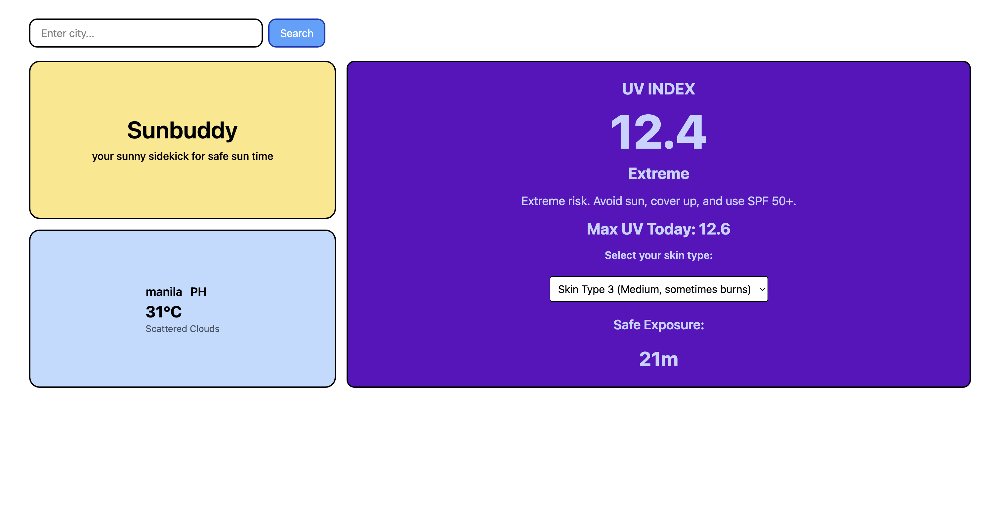

## SunBuddy 😎☀️

SunBuddy is a modern web app that helps users stay safe while enjoying the sun. It displays the current UV index, local weather, and safe sun exposure times based on your location or a city search.

I made this because I've been burnt by the rays multiple times and wanted an easy way to track uv exposure. This helps users enjoy sunny or cloudy days without risking sun damage.

## Features

Detects your current location and fetches local UV & weather data.

Search for any city worldwide.

Weather Display: temperature, conditions

UV Display: current UV index, maximum UV, and recommended safe exposure time.

Bento-style responsive layout: works on mobile and large screens.

Loading & error states for a smooth user experience.

Mobile-friendly and responsive Tailwind CSS design.

## How its made

#### Tech Stack

Next.js, TypeScript, Tailwind CSS, OpenWeatherMap for weather and geolocation

## What I Learned

State management - I learned the importance of separating state to prevent unexpected behaviors in react. I initially used a single state variable for both search and current city so I had some incorrent values.

Type safety with TypeScript- it helps catch bugs early and ensures that data from the api is handled safely.
